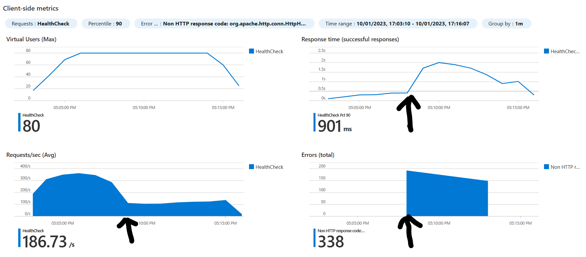

# Chaos Studio Experiments with Azure Load Test

[Azure Chaos Studio]( https://learn.microsoft.com/en-us/azure/chaos-studio/chaos-studio-overview) is a new Azure tool for inducing faults in a target to allow you to really test how well an application or service copes with issues, specific outages, high CPU, low memory etc. This has often been difficult to test in a consistent way, so often development teams do not do this form of testing. This can lead to services being deployed that do not survive outages. Chaos Studio allows you to run "experiments" against a service (it must be emphasised that this should only be a test service) and see how it reacts to these experiments.

[Azure Load Testing](https://learn.microsoft.com/en-us/azure/load-testing/overview-what-is-azure-load-testing) is a Azure's managed load testing service. This allows you to drive load into a service to see how it responds to high levels of load. Load testing really should be performed on all applications and Azure Load Testing simplifies the process of provisioning load test infrastructure and managing a series of tests and their results.

It is therefore natural to combine the use of both of these tools to test how an application or service copes with a problem when running at scale.

This repository is a workshop that combines the use of Chaos Studio with Azure Load Testing against an AKS-hosted API to Cosmos DB. The repository contains the code for the API and details how to deploy this to Azure and to then run combined chaos experiments alongside load tests to see the impact of an issue under load.

# Here is a taster of an experiment

The chaos experiment below, stops one of three pods for the application API that will be load tested.

This results in one pod in the cluster failing

When load testing, when the chaos experiment kicks in, the request rate of the API falls and also the response time increases. There are a few errors too!

## Overall Workshop Structure

1. Create AKS cluster
2. Create Cosmos database
3. Using the sample app in this repository, build, and deloy to the AKS cluster
4. Enable Chaos Studio for AKS and Cosmos
5. Build a Chaos Experiment
6. Provision a load test service
7. Configure a load test using the JMeter (JMX) test provided
8. Run a chaos experiment
9. Run a load test
10. Analysis results
11. Later run other Chaos experiments

## Getting Started

The bulk of the effort for this workshop is setting up the system under test. This has been chosen as an AKS-hosted API because Kubernetes has a chaos mesh that then can be controlled from chaos experiments in a granular way. Likewise Cosmos database has some chaos capability.

Rather than build an application from scratch, the one in this repository has been forked from [Humongous Healthcare sample app](https://github.com/microsoft/winwithappplatpoc/blob/main/Hands-On%20Lab.md#overview) Specifically, this workshop only needs the API part of the application and the instructions to install it are [here](https://github.com/microsoft/winwithappplatpoc/blob/main/Hands-On%20Lab.md#exercise-2--review-and-publish-the-humongous-healthcare-web-api-service). Tasks 1 - 4 are only needed.
